# 🤖 Mazo Pantheon - AI Hedge Fund

**One Team. One Dream. One AI-Powered Hedge Fund.**

An autonomous AI trading system that combines 18 specialized trading agents, deep financial research, and a Portfolio Manager to make intelligent trading decisions on your behalf.

> ⚠️ **Disclaimer**: This is for **educational and research purposes only**. Not financial advice. Use paper trading to test. Deploy to live trading at your own risk.


---

## 📖 Table of Contents

- [What Is This?](#-what-is-this)
- [Quick Start](#-quick-start-docker)
- [UI Overview](#-ui-overview)
  - [Main Tabs](#main-tabs)
  - [Monitoring Dashboard](#5-monitoring-dashboard)
  - [Transparency Sidebars](#transparency-sidebars)
  - [Bottom Panel](#bottom-panel)
- [The AI Team](#-the-ai-team)
- [Configuration](#-configuration)
- [Deployment Options](#-deployment-options)
- [Troubleshooting](#-troubleshooting)

---

## 🎯 What Is This?

Mazo Pantheon is a complete AI-powered trading platform that:

1. **Scans the market** for trading opportunities using multiple strategies
2. **Validates signals** through Mazo's deep research agent
3. **Analyzes trades** with 18 AI agents (each with unique investment philosophies)
4. **Executes decisions** through a Portfolio Manager that weighs all perspectives
5. **Runs autonomously** 24/7 on your own infrastructure

```
┌─────────────────────────────────────────────────────────────────────────┐
│                         YOUR AI TRADING TEAM                            │
├─────────────────────────────────────────────────────────────────────────┤
│                                                                         │
│   📊 Strategy Engine     →    🔬 Mazo Research    →    🧠 18 AI Agents │
│   (Market Scanning)           (Deep Analysis)          (Trading Views) │
│                                                                         │
│                              ↓                                          │
│                                                                         │
│                    💼 Portfolio Manager (Final Decision)                │
│                              ↓                                          │
│                    📈 Alpaca Trade Execution                            │
│                                                                         │
└─────────────────────────────────────────────────────────────────────────┘
```

---

## 🚀 Quick Start (Docker)

### Prerequisites

- Docker & Docker Compose
- API Keys (see [Configuration](#-configuration))

### Deploy in 3 Steps

```bash
# 1. Clone the repository
git clone https://github.com/yourusername/mazo-pantheon.git
cd mazo-pantheon

# 2. Configure your API keys
cp .env.example .env
nano .env  # Add your API keys

# 3. Deploy with Docker Compose
cd docker
docker-compose -f docker-compose.unraid.yml up -d
```

### Access the UI

| Service | URL |
|---------|-----|
| **Web UI** | http://localhost:5173 |
| **API Docs** | http://localhost:8000/docs |

---

## 🖥️ UI Overview

The UI is designed as a **"single pane of glass"** with three-column layout:

```
┌──────────────┬─────────────────────────────┬──────────────────┐
│  LEFT        │      MAIN CONTENT           │     RIGHT        │
│  SIDEBAR     │         AREA                │     SIDEBAR      │
│              │                             │                  │
│  AI Activity │  [Tab: AI Hedge Fund]       │  Intelligence    │
│  Feed        │  [Tab: Portfolio Health]    │  Panel           │
│              │  [Tab: Trading Dashboard]   │                  │
│  Real-time   │  [Tab: Command Center]      │  • Roster        │
│  events      │  [Tab: Settings]            │  • Research      │
│              │                             │  • Decision      │
│              │                             │  • Logs          │
├──────────────┴─────────────────────────────┴──────────────────┤
│                    BOTTOM PANEL                                │
│         Output  |  Research (Ask Mazo)  |  Raw JSON           │
└────────────────────────────────────────────────────────────────┘
```

---

## Main Tabs

### 1. AI Hedge Fund (Main Dashboard)

The primary interface for autonomous trading. Control your AI team from one screen.


**Key Features:**
- **Portfolio Overview** - Total equity, cash, P&L, positions
- **Budget Allocation Slider** - Set how much the AI can trade with
- **Risk Profile Selection** - Conservative, Balanced, Aggressive
- **AI Team Visualization** - See Mazo, 18 Analysts, and PM
- **Trading Pipeline** - Real-time status: Screened → Signals → Validated → Executed
- **Live Activity Feed** - Watch trades happen in real-time
- **Open Positions** - Current holdings with P&L

#### Live Server Example

Here's the dashboard running on a live Unraid server with autonomous trading enabled:


This shows:
- **Autonomous Mode ON** with "AI LIVE" indicator
- **Real portfolio data**: $4,976.33 equity, $12,097.83 cash
- **2 open positions**: AAPL SHORT (10 shares), MSFT SHORT (9 shares)
- **Live Activity Feed** showing previous analyses and trading cycles
- **40% budget allocation** ($1,990.53 effective budget)

#### Quick Analysis

Analyze any ticker instantly without waiting for the autonomous cycle:


Enter a ticker like "NVDA" and get:
- Overall signal (BULLISH/BEARISH/NEUTRAL)
- Confidence percentage
- Individual agent signals (Fundamentals, Technical, Warren, Cathie, etc.)

#### Live Analysis Example (TSLA)

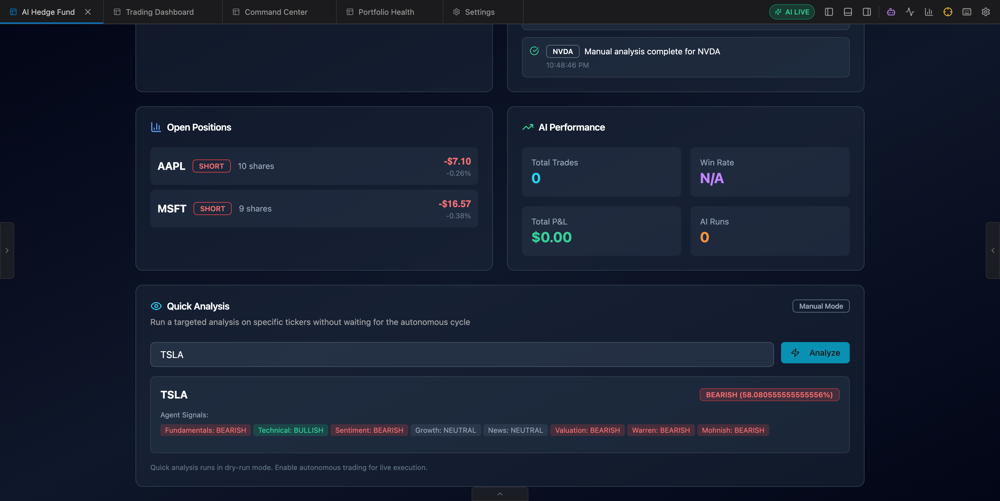

Real analysis of TSLA on a live server showing:
- **BEARISH signal** with 58.08% confidence
- **Agent breakdown**: Fundamentals (BEARISH), Technical (BULLISH), Sentiment (BEARISH), Growth (NEUTRAL), News (NEUTRAL), Valuation (BEARISH), Warren (BEARISH), Mohnish (BEARISH)
- **Activity logged** to Live Activity feed with timestamps

---

### 2. Portfolio Health

AI-powered portfolio health check with Mazo research.


**What You Get:**
- **Health Grade** (A+ to F) with risk level indicator
- **Position Table** - All positions with entry price, current price, P&L, % of portfolio
- **Concentration Analysis** - Are you over-exposed?
- **Specific Recommendations** - What to buy/sell/hold

#### Detailed Mazo Analysis

The AI provides comprehensive rebalancing recommendations:


- Position-by-position breakdown
- Risk scenario analysis (What if market drops 10%?)
- Priority action items with urgency levels
- Sources from financial APIs and SEC filings

---

### 3. Trading Dashboard

Your trading command center with full pipeline visibility.


**Sections:**
- **Performance Metrics** - Equity, unrealized P&L, win rate
- **AI Trading Pipeline** - Run cycles manually or view status
- **Latest AI Decisions** - Recent BUY/SELL/SHORT signals
- **Open Positions** - Current holdings
- **Watchlist** - Stocks you're monitoring
- **Scheduled Tasks** - Automated trading schedules

---

### 4. Command Center

Unified view for monitoring everything at once.


**Tabs:**
- **Overview** - Positions, scheduled actions, recent decisions
- **Trade History** - Full log of all executed trades
- **Agent Leaderboard** - Track which agents perform best


---

### 5. Monitoring Dashboard

Real-time system monitoring, alerts, and performance analytics.

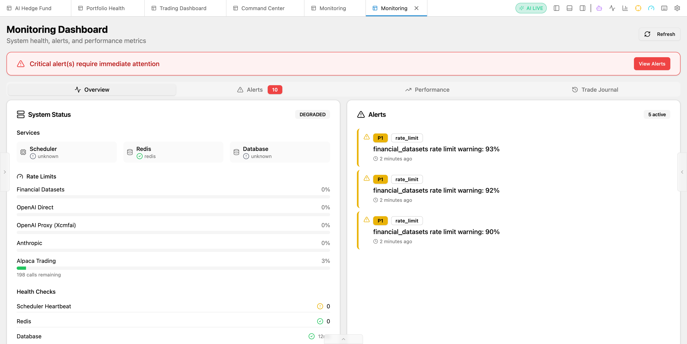

**Overview Tab Features:**
- **System Status** - Overall health (Healthy/Degraded/Down)
- **Services** - Scheduler, Redis, Database status
- **Rate Limits** - API quota tracking (Financial Datasets, OpenAI, Anthropic, Alpaca)
- **Health Checks** - Scheduler heartbeat, Redis ping, DB latency
- **Daily Metrics** - Workflows run, signals generated, trades executed, win rate

#### Alerts Tab

Real-time alert monitoring with priority levels and detailed context:

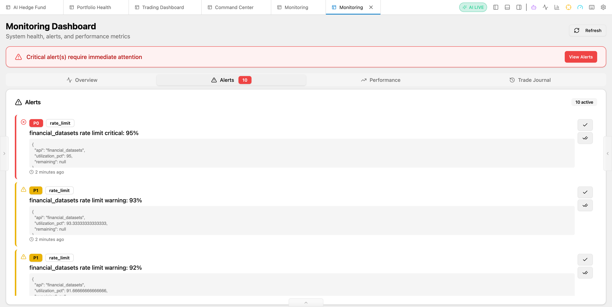

**Alert Features:**
- **Priority Levels** - P0 (Critical), P1 (Warning), P2 (Info)
- **Alert Types** - Rate limit warnings, system errors, trade failures
- **Detailed Payload** - JSON context for debugging
- **Timestamps** - When alerts were triggered
- **Actions** - Acknowledge, dismiss, investigate

#### Performance Tab

Analytics on workflow efficiency and agent performance:

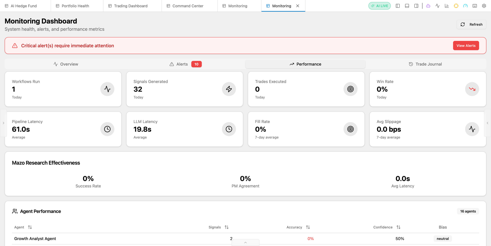

**Performance Metrics:**
- **Workflows Run** - Total analysis cycles today
- **Signals Generated** - Agent signals produced
- **Pipeline Latency** - Average workflow time
- **LLM Latency** - Average AI model response time
- **Mazo Research Effectiveness** - Success rate, PM agreement
- **Agent Performance Table** - All 18 agents with signals count, accuracy, confidence, and bias

#### Trade Journal Tab

Complete audit trail of all trades executed by the AI:

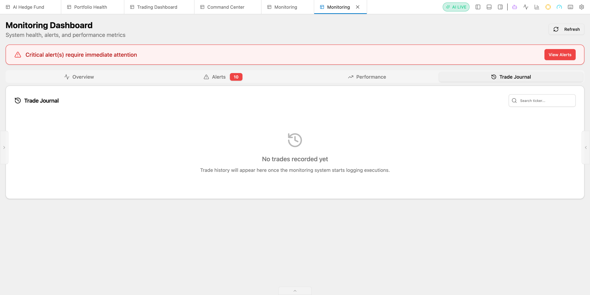

**Trade Journal Features:**
- **Trade History** - All executed orders with timestamps
- **Search** - Filter by ticker
- **Execution Details** - Side, quantity, price, status
- **Performance Tracking** - Win/loss tracking per trade

---

### 6. Settings

Configure everything via the web UI - no file editing needed.


**Configuration Sections:**
- **Financial Data APIs** - FMP (Primary), Financial Datasets
- **Language Models** - OpenAI, Anthropic, Groq, DeepSeek, Google
- **Custom Relay URLs** - For proxy/enterprise endpoints
- **Azure OpenAI** - Enterprise Azure configuration
- **Trading Integration** - Alpaca API keys and mode (paper/live)
- **Mazo Research** - Path, timeout, default depth
- **Data Source Fallbacks** - Yahoo Finance, Financial Datasets as backups
- **Primary Data Source** - Select which API to use first for market data

### Data Sources

| Source | Prices | News | Fundamentals | Insider Trades | API Key Required |
|--------|:------:|:----:|:------------:|:--------------:|:----------------:|
| **FMP Ultimate** ⭐ | ✅ | ✅ | ✅ | ✅ | Yes |
| **Alpaca Market Data** | ✅ | ✅ | ❌ | ❌ | Yes (trading keys) |
| **Financial Datasets** | ✅ | ✅ | ✅ | ✅ | Yes |
| **Yahoo Finance** | ✅ | ✅ | ✅ | ❌ | No |

> **Recommended Setup:** Use **FMP Ultimate** as your primary data source for comprehensive coverage. Alpaca remains your trading execution provider. Yahoo Finance serves as a free fallback.
>
> **Note:** When using Alpaca as primary data source, fundamentals (P/E ratios, financial statements, etc.) automatically fall back to Yahoo Finance or FMP. Alpaca uses your existing trading API keys.

---

## Transparency Sidebars

The UI includes **transparency panels** on both sides for full insight into AI operations. These sidebars populate with **real-time data** as you run analyses, trading cycles, or any AI workflow.

### Left Sidebar: AI Activity Feed

Real-time timeline showing every AI action as it happens. The sidebar automatically updates when you:
- Run a **Quick Analysis** on a ticker
- Click **Run Cycle Now** for a manual trading cycle
- Enable **Autonomous Mode** (continuous trading)

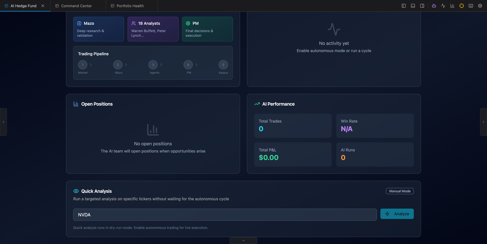

**Each Activity Entry Shows:**
- **Ticker Badge** - The stock symbol being analyzed (e.g., NVDA)
- **Action Message** - What happened (e.g., "Starting Quick Analysis for NVDA")
- **Timestamp** - When the event occurred
- **Status Indicators** - Success, error, or in-progress states
- **Pin Button** - Pin important activities for reference

**Event Types Captured:**
| Icon | Type | Description |
|------|------|-------------|
| ⏳ | `workflow_start` | Analysis or cycle beginning |
| ✅ | `agent_complete` | Individual agent finished |
| 🧠 | `pm_decision` | Portfolio Manager made a decision |
| ⚡ | `trade_executed` | Trade was placed |
| ❌ | `error` | Something went wrong |

**Toolbar Features:**
- 🔍 **Search** - Filter activities by ticker or keyword
- 📥 **Export** - Download activity log as JSON
- 🗑️ **Clear** - Reset the activity feed
- 🔽 **Auto-scroll** - Follow new events in real-time

---

### Right Sidebar: Intelligence Panel

Four tabs providing deep insight into AI operations.

#### Roster Tab - Your AI Team

View all 20 AI entities at a glance. Click any agent button to see their details and current signal status.

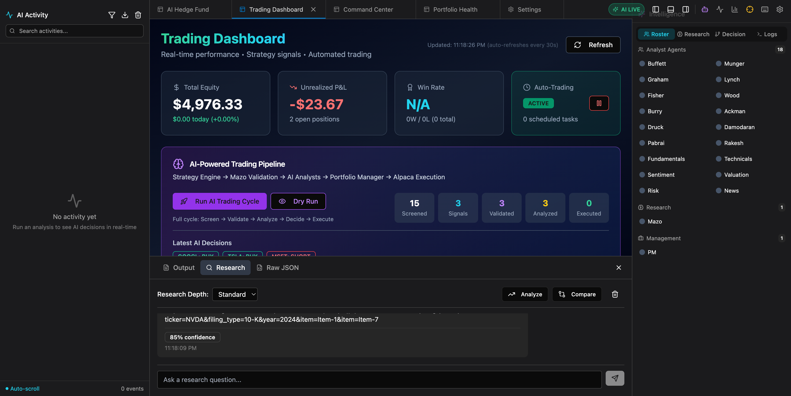

**Categories:**
- **18 Analyst Agents** - Buffett, Munger, Graham, Lynch, Fisher, Wood, Burry, Ackman, Druckenmiller, Damodaran, Pabrai, Rakesh, Fundamentals, Technicals, Sentiment, Valuation, Risk, News
- **1 Research Agent** - Mazo (deep research)
- **1 Management Agent** - PM (Portfolio Manager)

**Clicking an Agent Button** shows an info card:


Each agent card displays:
- **Name** - The agent's identity (e.g., "Warren Buffett", "Portfolio Manager")
- **Specialty** - What they focus on:
  - Warren Buffett: "Value investing, economic moats"
  - Michael Burry: "Contrarian, deep value"
  - Mazo Research: "Deep web research, comprehensive analysis"
  - Portfolio Manager: "Final decision maker, signal consolidation"
- **Signal Status** - Current signal ("No signal yet" or BULLISH/BEARISH/NEUTRAL)
- **Close Button** - Dismisses the card

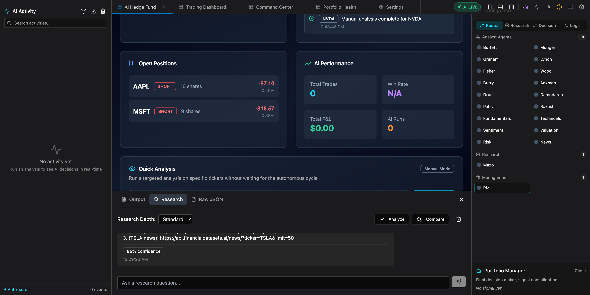

#### Research Tab

Displays Mazo research reports from workflow runs. Populates when the unified workflow runs with SSE streaming.


#### Decision Tab

Visualizes the decision tree - how the PM arrived at its conclusion. Shows the final recommendation and confidence level.

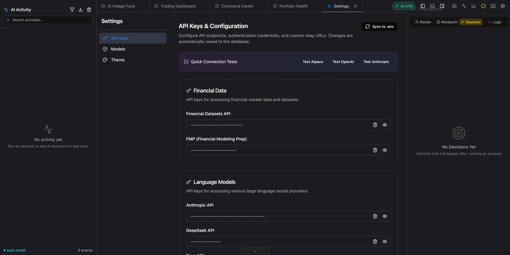

#### Logs Tab - Console Output

Real-time console output for debugging and monitoring. Shows detailed log entries as the system operates.

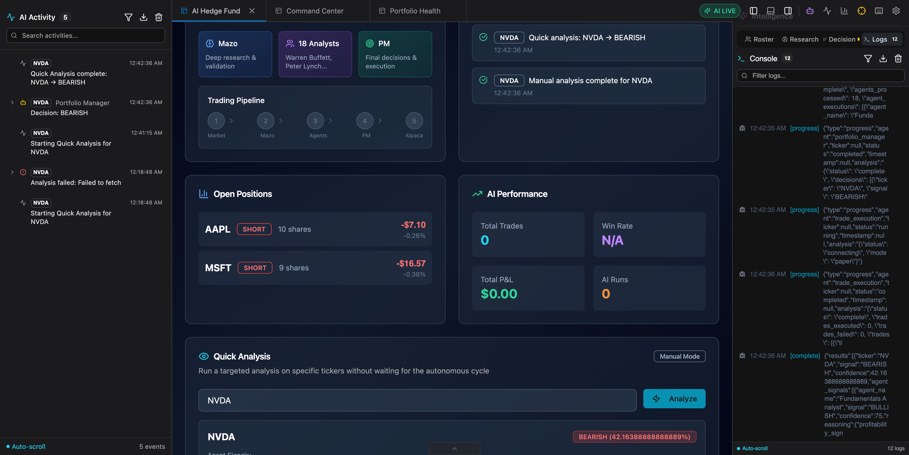

**Log Entry Format:**
```
12:18:48 AM [QuickAnalysis] Initiating analysis for NVDA
12:18:48 AM [QuickAnalysis] Failed to fetch
```

**Each Log Entry Contains:**
- **Timestamp** - Precise time of the event
- **Source Tag** - Which component generated the log (e.g., `QuickAnalysis`, `TradingCycle`, `Mazo`)
- **Message** - The log content
- **Log Level** - Color-coded: Info (blue), Debug (gray), Error (red)

**Toolbar Features:**
- 🔍 **Filter** - Search logs by keyword
- 📋 **Copy** - Copy log to clipboard
- 🗑️ **Clear** - Reset the console
- 🔽 **Auto-scroll** - Follow new logs

---

### E2E Testing: Sidebars With Live Data (tower.local.lan)

All E2E tests performed against **tower.local.lan:8000** production API:

#### Left Sidebar - Activity Feed (Populated)

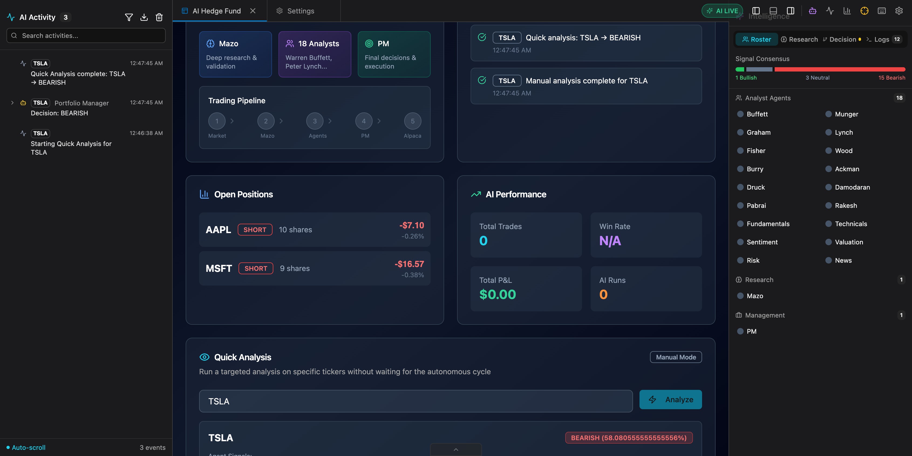

**Live Data Shows:**
- 3 events from TSLA analysis
- "Quick Analysis complete: TSLA → BEARISH"
- "Portfolio Manager - Decision: BEARISH"
- Timestamps for each event

#### Roster Tab - Signal Consensus


**Live Data Shows:**
- **Signal Consensus**: 1 Bullish, 3 Neutral, 15 Bearish
- All 18 analyst agents + Mazo + PM visible
- Live signal status after analysis

#### Decision Tab (Populated)

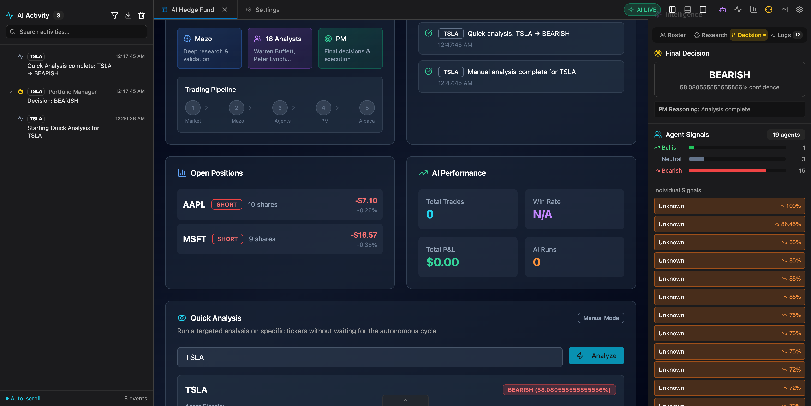

**Live Data Shows:**
- **Final Decision**: BEARISH (58.08% confidence)
- **PM Reasoning**: Analysis complete
- **Agent Signals**: 1 Bullish, 3 Neutral, 15 Bearish
- **Individual Signals**: All 19 agents with confidence percentages
- **Decision Flow**: 18 Agents → Mazo → PM

#### Logs Tab (Populated)

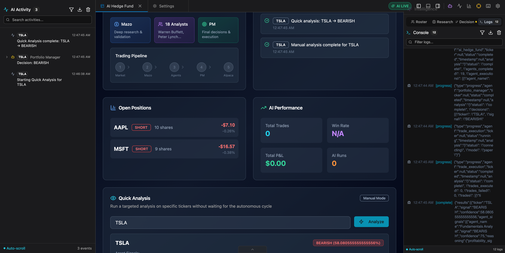

**Live Data Shows:**
- 12 console logs from SSE stream
- workflow_start, data_aggregation events
- ai_hedge_fund, agents processing
- portfolio_manager, trade_execution
- Complete event with full results JSON

---

### Sidebar Data Flow

The transparency sidebars receive data from different sources:

| Panel | Data Source | When Populated |
|-------|-------------|----------------|
| **Left: AI Activity** | Quick Analysis, Run Cycle, Autonomous Mode | Real-time during operations |
| **Roster Tab** | Static agent list | Always visible |
| **Research Tab** | Unified workflow SSE events | During full workflow runs |
| **Decision Tab** | Portfolio Manager decisions | After analysis completes |
| **Logs Tab** | Console logging from all components | Real-time during operations |

**Note:** The Research and Decision tabs populate from the unified workflow SSE stream. Quick Analysis and "Ask Mazo" in the bottom panel work independently but don't populate these sidebar tabs - they show results directly in their respective UI sections.

---

## Bottom Panel

Expandable panel with three tabs for deep-dive information.

### Research Tab - Ask Mazo

Ask natural language questions about any stock or market topic:

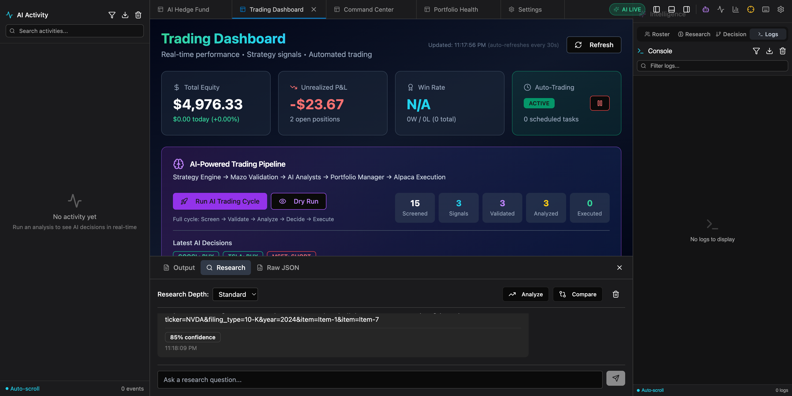

**Features:**
- **Research Depth** - Quick (30s), Standard (1-2min), Deep (5min+)
- **Natural Language** - Ask "What's driving NVDA's growth?"
- **Sourced Responses** - Links to financial APIs, SEC filings
- **Confidence Scores** - 85% confidence with reasoning
- **Analyze Button** - Deep-dive into specific tickers
- **Compare Button** - Compare multiple stocks

### Output Tab

Shows workflow progress and results during analysis runs.

### Raw JSON Tab

View the complete API response for debugging or integration.

---

## 🤖 The AI Team

### Trading Agents (18 Total)

Each agent analyzes stocks from a unique investment philosophy:

| Category | Agents | Philosophy |
|----------|--------|------------|
| **Value Investors** | Ben Graham, Warren Buffett, Charlie Munger, Mohnish Pabrai, Michael Burry | Margin of safety, quality at fair prices |
| **Growth Investors** | Cathie Wood, Peter Lynch, Phil Fisher | Innovation, ten-baggers, scuttlebutt |
| **Macro/Quant** | Stanley Druckenmiller, Aswath Damodaran | Asymmetric opportunities, disciplined valuation |
| **Activist** | Bill Ackman, Rakesh Jhunjhunwala | Activist positions, emerging markets |
| **Technical** | Valuation, Sentiment, Fundamentals, Technicals, Risk Manager, News | Data-driven analysis |
| **Decision Maker** | Portfolio Manager | Weighs all signals, makes final call |

### Mazo Research Agent

Deep autonomous research that:
- Searches the web for real-time information
- Analyzes company fundamentals from SEC filings
- Provides comprehensive investment thesis
- Validates or challenges trading signals
- Returns confidence scores with sources

---

## ⚙️ Configuration

### Required API Keys

| Key | Purpose | Get It |
|-----|---------|--------|
| `FMP_API_KEY` | Primary data source (prices, fundamentals, news, insider trades) | [financialmodelingprep.com](https://financialmodelingprep.com/) |
| `OPENAI_API_KEY` | LLM for AI agents | [platform.openai.com](https://platform.openai.com/) |
| `ALPACA_API_KEY` + `ALPACA_SECRET_KEY` | Trade execution | [alpaca.markets](https://alpaca.markets/) |

### Optional API Keys

| Key | Purpose |
|-----|---------|
| `ANTHROPIC_API_KEY` | Claude models |
| `GROQ_API_KEY` | Fast inference |
| `GOOGLE_API_KEY` | Gemini models |
| `TAVILY_API_KEY` | Web search for research |
| `FINANCIAL_DATASETS_API_KEY` | Alternative financial data source |

### Environment Variables

```bash
# ===========================================
# REQUIRED - Core Functionality
# ===========================================
FMP_API_KEY=your-fmp-api-key           # Primary data source
OPENAI_API_KEY=your-key
ALPACA_API_KEY=your-key
ALPACA_SECRET_KEY=your-secret
ALPACA_BASE_URL=https://paper-api.alpaca.markets/v2
ALPACA_TRADING_MODE=paper

# ===========================================
# DATA SOURCE CONFIGURATION
# ===========================================
PRIMARY_DATA_SOURCE=fmp                 # Options: fmp, alpaca, financial_datasets, yahoo_finance

# ===========================================
# DOCKER DEPLOYMENT
# ===========================================
MAZO_PATH=/app/mazo          # Path inside container
MAZO_TIMEOUT=300
POSTGRES_PASSWORD=your-secure-password

# ===========================================
# AUTONOMOUS TRADING
# ===========================================
AUTO_TRADING_ENABLED=false   # Set to true to enable
TRADING_INTERVAL_MINUTES=30  # How often to scan

# Trade Cooldown & Concentration Limits
TRADE_COOLDOWN_MINUTES=30    # Min minutes between trades for same ticker
MAX_POSITION_PCT_PER_TICKER=0.15  # Max 15% of portfolio per ticker
TRADE_COOLDOWN_ENABLED=true  # Enable/disable cooldown checks
TRADE_CONCENTRATION_CHECK_ENABLED=true  # Enable/disable concentration checks

# ===========================================
# REAL-TIME QUOTES & PDT PROTECTION
# ===========================================
USE_INTRADAY_DATA=true       # Use live quotes for strategy signals
QUOTE_CACHE_SECONDS=30       # How long to cache quotes
ENFORCE_PDT=true             # Pattern Day Trader protection (recommended)
PDT_EQUITY_THRESHOLD=25000   # PDT equity threshold ($25k default)

# ===========================================
# FRACTIONAL SHARES
# ===========================================
ALLOW_FRACTIONAL=true        # Enable fractional share trading
MIN_FRACTIONAL_QTY=0.001     # Minimum fractional quantity
FRACTIONAL_PRECISION=4       # Decimal places for fractional trades

# ===========================================
# SMALL ACCOUNT MODE (Dynamic Micro-Trading)
# ===========================================
SMALL_ACCOUNT_MODE=false              # Enable dynamic small account mode
SMALL_ACCOUNT_EQUITY_THRESHOLD=10000  # Activate when equity <= this value
SMALL_ACCOUNT_TARGET_NOTIONAL=30      # Target $ per trade (e.g., $30)
SMALL_ACCOUNT_MAX_SIGNALS=15          # Max signals per cycle (higher than standard)
SMALL_ACCOUNT_MIN_CONFIDENCE=55       # Lower confidence threshold
SMALL_ACCOUNT_MAX_POSITIONS=30        # Allow more positions for diversification
SMALL_ACCOUNT_MAX_POSITION_PCT=0.05   # Lower per-position limit (5%)
SMALL_ACCOUNT_MIN_BUYING_POWER_PCT=0.02  # Keep cash flowing (2%)
SMALL_ACCOUNT_COOLDOWN_MINUTES=10     # Shorter cooldown
SMALL_ACCOUNT_MAX_TICKER_PRICE=500    # Max price for tickers in universe
SMALL_ACCOUNT_INCLUDE_ETFS=true       # Include affordable ETFs
SMALL_ACCOUNT_ENABLE_SCALPING=true    # Enable VWAP/breakout micro strategies

# ===========================================
# RISK LIMITS
# ===========================================
TRADING_RISK_MAX_POSITION_PCT=0.20  # Max 20% per position
TRADING_RISK_MAX_SECTOR_PCT=0.30    # Max 30% per sector
TRADING_RISK_MAX_POSITIONS=20       # Max open positions
TRADING_RISK_MAX_HOLD_HOURS=120     # Max hold time (5 days)

# ===========================================
# CACHE TTL (Optional - in seconds)
# =========================================== 
CACHE_TTL_QUOTES=60          # Real-time quotes (1 min)
CACHE_TTL_PRICES_INTRADAY=300 # Intraday bars (5 min)
CACHE_TTL_PRICES=3600        # Daily prices (1 hour)
CACHE_TTL_NEWS=600           # News articles (10 min)
CACHE_TTL_METRICS=86400      # Fundamentals (24 hours)
```

### 🔄 Switching Data Providers

The system supports multiple market data providers with automatic fallback:

| Provider | Data Types | API Key Required |
|----------|------------|------------------|
| **FMP Ultimate** ⭐ | Prices, Fundamentals, News, Insider Trades | Yes |
| **Alpaca Market Data** | Prices, News | Yes (same as trading) |
| **Financial Datasets** | Prices, Fundamentals, Insider Trades | Yes |
| **Yahoo Finance** | Prices, Basic Fundamentals | No (fallback only) |

#### How to Switch Providers

**Option 1: Via Settings UI**

1. Navigate to **Settings** → **Data Source Fallbacks**
2. Select your preferred **Primary Data Source**
3. The change takes effect immediately

**Option 2: Via Environment Variable**

```bash
# In your .env file:
PRIMARY_DATA_SOURCE=fmp         # FMP Ultimate (recommended)
PRIMARY_DATA_SOURCE=alpaca      # Alpaca Market Data
PRIMARY_DATA_SOURCE=financial_datasets  # Financial Datasets API
```

#### Fallback Chain

When the primary source fails, the system automatically tries alternatives:

```
FMP (primary) → Alpaca → Financial Datasets → Yahoo Finance
```

This ensures your trading system stays operational even if one API has issues.

#### Verify Your Setup

Run the health check script to verify all providers are configured:

```bash
python scripts/check-data-providers.py
```

---

## 📦 Deployment Options

### Option 1: Unraid (Recommended for Home Labs)

```bash
# SSH to your Unraid server
ssh root@your-unraid-server

# Clone and deploy
cd /mnt/user/appdata
git clone https://github.com/yourusername/mazo-pantheon.git
cd mazo-pantheon

# Configure
cp .env.example .env
nano .env  # Set MAZO_PATH=/app/mazo

# Deploy
cd docker
docker-compose -f docker-compose.unraid.yml up -d
```

Access at: `http://your-unraid-ip:5173`

### Option 2: Docker Compose (Any Server)

```bash
docker-compose -f docker/docker-compose.unraid.yml up -d
```

### Option 3: Local Development

```bash
# Backend
cd mazo-pantheon
python -m venv venv
source venv/bin/activate
pip install -r requirements.txt
cd mazo && bun install && cd ..
uvicorn app.backend.main:app --port 8000

# Frontend (new terminal)
cd app/frontend
npm install
npm run dev
```

---

## 🏗️ Architecture

```
┌─────────────────────────────────────────────────────────────────────────┐
│                           DOCKER CONTAINERS                             │
├─────────────────────────────────────────────────────────────────────────┤
│                                                                         │
│  ┌─────────────────┐  ┌─────────────────┐  ┌─────────────────────────┐ │
│  │  mazo-frontend  │  │  mazo-backend   │  │  mazo-postgres          │ │
│  │  (React/Nginx)  │  │  (FastAPI)      │  │  (Trade History)        │ │
│  │  Port: 5173     │  │  Port: 8000     │  │  Port: 5432             │ │
│  └─────────────────┘  └─────────────────┘  └─────────────────────────┘ │
│                                                                         │
│  ┌─────────────────────────────────────────────────────────────────────┐│
│  │                        Backend Services                             ││
│  ├─────────────────────────────────────────────────────────────────────┤│
│  │  • 18 AI Trading Agents (LangGraph)                                 ││
│  │  • Mazo Research Agent (Bun/TypeScript)                             ││
│  │  • Strategy Engine (Momentum, Mean Reversion, Trend)                ││
│  │  • Portfolio Manager (Aggregates all signals)                       ││
│  │  • Autonomous Scheduler (APScheduler)                               ││
│  │  • Alpaca Trading Integration                                       ││
│  └─────────────────────────────────────────────────────────────────────┘│
│                                                                         │
│  ┌─────────────────┐                                                    │
│  │  mazo-redis     │ ← Caching Layer                                    │
│  │  Port: 6379     │                                                    │
│  └─────────────────┘                                                    │
│                                                                         │
└─────────────────────────────────────────────────────────────────────────┘
```

---

## 📁 Project Structure

```
mazo-pantheon/
├── docker/                    # 🐳 Docker deployment
│   ├── docker-compose.unraid.yml
│   ├── Dockerfile.backend
│   └── Dockerfile.frontend
├── app/
│   ├── backend/               # 🐍 FastAPI server
│   │   ├── main.py
│   │   ├── routes/
│   │   └── services/
│   └── frontend/              # ⚛️ React UI
│       └── src/
│           ├── components/
│           │   ├── autonomous/     # AI Hedge Fund components
│           │   ├── command-center/ # Command Center components
│           │   ├── panels/         # Sidebar panels
│           │   ├── trading/        # Trading Dashboard
│           │   └── ui/             # Shadcn/ui components
│           └── services/           # API and state management
├── src/
│   ├── agents/                # 🤖 18 AI trading agents
│   ├── trading/               # 📈 Trading services
│   └── tools/                 # 🔧 Financial data APIs
├── mazo/                      # 🔬 Research agent (TypeScript)
├── integration/               # 🔗 Workflow orchestration
└── docs/
    └── screenshots/           # 📸 UI screenshots
```

---

## 🛡️ Trading Guardrails & Safety

The autonomous trading system includes multiple safety layers to protect your capital:

### Pattern Day Trader (PDT) Protection

If your account equity is below $25,000, FINRA's PDT rule limits you to 3 day trades per rolling 5 business days.

| Setting | Default | Description |
|---------|---------|-------------|
| `ENFORCE_PDT` | `true` | Enable PDT protection |
| `PDT_EQUITY_THRESHOLD` | `25000` | PDT threshold (USD) |

**How it works:**
1. Before each trading cycle, the system checks your account equity and day trade count
2. If equity < $25k AND day trades ≥ 3, the cycle is **blocked**
3. A warning is logged and surfaced in the Monitoring dashboard
4. With equity ≥ $25k, there are no day trading restrictions

> 📚 See [Alpaca PDT Documentation](https://alpaca.markets/docs/trading/pattern-day-trader/) for details.

### Real-Time Quotes

The strategy engine can use live intraday prices instead of stale daily closes:

| Setting | Default | Description |
|---------|---------|-------------|
| `USE_INTRADAY_DATA` | `true` | Fetch live quotes for signals |
| `QUOTE_CACHE_SECONDS` | `30` | Quote cache TTL |

**Quote fallback chain:**
```
Live Trade Price → Quote Midpoint → Position Current Price → Last Close
```

### Position Risk Limits

| Setting | Default | Description |
|---------|---------|-------------|
| `TRADING_RISK_MAX_POSITION_PCT` | `0.20` | Max 20% per position |
| `TRADING_RISK_MAX_SECTOR_PCT` | `0.30` | Max 30% per sector |
| `TRADING_RISK_MAX_POSITIONS` | `20` | Max open positions |
| `TRADING_RISK_MAX_HOLD_HOURS` | `120` | Max hold time (5 days) |

### PM Stop-Loss & Take-Profit Enforcement

When the Portfolio Manager specifies `stop_loss_pct` or `take_profit_pct` in a trade decision:

1. These values are automatically applied to the **Position Monitor**
2. The Position Monitor checks positions every 5 minutes
3. If a position hits the PM's thresholds, it's closed automatically

```
PM Decision: "Buy AAPL with 5% stop-loss, 12% take-profit"
     ↓
Position Monitor: Applies custom rules (not defaults)
     ↓
Auto-exit when thresholds hit
```

### Fractional Shares

Trade fractional shares on supported assets:

| Setting | Default | Description |
|---------|---------|-------------|
| `ALLOW_FRACTIONAL` | `true` | Enable fractional trading |
| `MIN_FRACTIONAL_QTY` | `0.001` | Minimum quantity |
| `FRACTIONAL_PRECISION` | `4` | Decimal places |

**Fractionable detection:** The system checks each asset via Alpaca's `/assets` endpoint to determine if it supports fractional trading. Non-fractionable assets (like BRK.A) are automatically rounded to whole shares.

> 📚 See [Alpaca Fractional Shares](https://alpaca.markets/docs/trading/fractional-trading/) for details.

### Trade Cooldowns

Prevent rapid-fire trading on the same ticker:

| Setting | Default | Description |
|---------|---------|-------------|
| `TRADE_COOLDOWN_ENABLED` | `true` | Enable cooldown checks |
| `TRADE_COOLDOWN_MINUTES` | `30` | Min time between trades |
| `MAX_POSITION_PCT_PER_TICKER` | `0.15` | Max concentration per ticker |

---

## 💰 Small Account Mode

For accounts under $10,000, the system can dynamically adjust its trading behavior to enable more frequent, smaller trades:

### What it Does

| Standard Mode | Small Account Mode |
|--------------|-------------------|
| 5 signals/cycle max | 15 signals/cycle max |
| 60% confidence min | 55% confidence min |
| 5% position sizing | $30 fixed notional |
| 30 min cooldown | 10 min cooldown |
| 20 max positions | 30 max positions |

### How to Enable

**Option 1: Environment Variable**
```bash
SMALL_ACCOUNT_MODE=true
SMALL_ACCOUNT_EQUITY_THRESHOLD=10000  # Activate when equity <= $10k
```

**Option 2: Settings UI**
Coming soon - will be configurable in Settings.

### How it Works

1. **Automatic Detection**: At the start of each trading cycle, the system checks your account equity
2. **Dynamic Parameters**: If equity is below threshold, parameters automatically adjust
3. **Notional Sizing**: Instead of % sizing, uses fixed dollar amounts per trade (e.g., $30)
4. **Extra Strategies**: Enables intraday strategies like VWAP Scalper and Breakout Micro
5. **Affordable Universe**: Filters tickers by max price and includes liquid ETFs

### Monitoring

Check the Monitoring Dashboard → System Status → "Small Account Mode" section to see:
- Whether mode is active
- Current equity vs threshold
- Effective parameters in use

### Best Practices for Small Accounts

1. ✅ Use **paper trading** first to validate the system works for your account
2. ✅ Start with conservative settings (`SMALL_ACCOUNT_TARGET_NOTIONAL=25`)
3. ✅ Monitor PDT limits carefully (3 day trades per 5 days under $25k)
4. ✅ Enable fractional shares (`ALLOW_FRACTIONAL=true`)
5. ⚠️ Be aware that many small trades = more transaction costs

---

## 🛠️ Troubleshooting

### Container won't start

```bash
# Check logs
docker logs mazo-backend

# Common issues:
# - Missing API keys in .env
# - MAZO_PATH not set to /app/mazo
# - Port already in use
```

### CORS errors in browser

The backend allows all origins by default. If you see CORS errors:
```bash
docker restart mazo-backend
```

### API keys not working

Configure via the web UI: Settings → API Keys
Or sync from .env:
```bash
curl -X POST http://localhost:8000/api-keys/sync-to-env
```

### Black screen on Trading Dashboard

1. Hard refresh (Cmd+Shift+R)
2. Check browser console for errors
3. Verify backend is running: `curl http://localhost:8000/`

---

## 📸 All Screenshots

| # | Screenshot | Description |
|---|-----------|-------------|
| 1 | [AI Hedge Fund Main](docs/screenshots/01-ai-hedge-fund-main.png) | Main autonomous trading dashboard |
| 2 | [Quick Analysis](docs/screenshots/02-quick-analysis-result.png) | Instant ticker analysis with agent signals |
| 3 | [Portfolio Health Empty](docs/screenshots/03-portfolio-health-empty.png) | Health check before running |
| 4 | [Portfolio Health Result](docs/screenshots/04-portfolio-health-result.png) | Health grade with metrics |
| 5 | [Portfolio Health Analysis](docs/screenshots/05-portfolio-health-analysis.png) | Full Mazo rebalancing recommendations |
| 6 | [Trading Dashboard](docs/screenshots/06-trading-dashboard.png) | Pipeline, positions, decisions |
| 7 | [Command Center](docs/screenshots/07-command-center-overview.png) | Unified monitoring view |
| 8 | [Agent Leaderboard](docs/screenshots/08-command-center-leaderboard.png) | Agent performance tracking |
| 9 | [Settings API Keys](docs/screenshots/09-settings-api-keys.png) | API configuration |
| 10 | [Settings Full](docs/screenshots/10-settings-full.png) | Complete settings with fallbacks |
| 11 | [Sidebar Research](docs/screenshots/11-sidebar-research.png) | Right sidebar Research tab |
| 12 | [Sidebar Decision](docs/screenshots/12-sidebar-decision.png) | Right sidebar Decision tab |
| 13 | [Sidebar Logs](docs/screenshots/13-sidebar-logs.png) | Right sidebar Logs tab |
| 14 | [Live Activity](docs/screenshots/14-live-activity-with-data.png) | AI Activity feed with events |
| 15 | [AI Cycle Running](docs/screenshots/15-ai-cycle-running.png) | Trading cycle in progress |
| 16 | [Bottom Panel](docs/screenshots/16-bottom-panel-open.png) | Output/Research/JSON tabs |
| 17 | [Cycle Complete](docs/screenshots/17-trading-cycle-complete.png) | Completed cycle with decisions |
| 18 | [Research Panel](docs/screenshots/18-research-panel.png) | Ask Mazo interface |
| 19 | [Mazo Research Result](docs/screenshots/19-mazo-research-result.png) | NVDA growth analysis |
| 20 | [Research with Sidebar](docs/screenshots/20-research-with-sidebar.png) | Research + sidebar view |
| 21 | [Agent Roster](docs/screenshots/21-roster-with-agents.png) | 18 agents + Mazo + PM |
| 22 | [Left Sidebar Activity](docs/screenshots/left-sidebar-activity.png) | AI Activity Feed populated with analysis events |
| 23 | [Right Sidebar Logs](docs/screenshots/right-sidebar-logs.png) | Console Logs tab with real-time output |
| 24 | [Sidebars Working](docs/screenshots/sidebars-working.png) | Both sidebars showing live data |
| 25 | [Live Dashboard](docs/screenshots/live-dashboard-tower.png) | Live server with autonomous trading ON |
| 26 | [Live TSLA Analysis](docs/screenshots/live-analysis-tsla.png) | Real-time TSLA analysis with agent signals |
| 27 | [Live Agent Roster](docs/screenshots/live-agent-roster.png) | Agent roster on live server |
| 28 | [Mazo Research TSLA](docs/screenshots/mazo-research-tsla.png) | Deep Mazo research on TSLA drivers |
| 29 | [Roster + Research](docs/screenshots/roster-with-mazo-research.png) | Roster tab with Mazo research visible |
| 30 | [Research Tab Empty](docs/screenshots/sidebar-research-empty.png) | Research sidebar before workflow |
| 31 | [Decision Tab Empty](docs/screenshots/sidebar-decision-empty.png) | Decision sidebar before workflow |
| 32 | [Logs Tab Empty](docs/screenshots/sidebar-logs-empty.png) | Logs sidebar before operations |
| 33 | [Buffett Agent Card](docs/screenshots/roster-agent-buffett.png) | Clickable agent info card |
| 34 | [PM Agent Card](docs/screenshots/roster-agent-pm.png) | Portfolio Manager info card |
| 35 | [Full Interface](docs/screenshots/full-interface-sidebars.png) | Complete 3-column layout |
| 36 | [Tower E2E Left Sidebar](docs/screenshots/tower-e2e-left-sidebar.png) | Activity feed with live TSLA analysis |
| 37 | [Tower E2E Roster Tab](docs/screenshots/tower-e2e-roster-tab.png) | Signal consensus: 1 Bullish, 3 Neutral, 15 Bearish |
| 38 | [Tower E2E Decision Tab](docs/screenshots/tower-e2e-decision-tab.png) | BEARISH 58.08% with 19 agent signals |
| 39 | [Tower E2E Logs Tab](docs/screenshots/tower-e2e-logs-tab.png) | Console with 12 SSE event logs |
| 40 | [Monitoring Overview](docs/screenshots/monitoring-overview.png) | System status, rate limits, health checks |
| 41 | [Monitoring Alerts](docs/screenshots/monitoring-alerts.png) | Real-time alerts with priority levels |
| 42 | [Monitoring Performance](docs/screenshots/monitoring-performance.png) | Workflow & agent performance metrics |
| 43 | [Monitoring Trade Journal](docs/screenshots/monitoring-trade-journal.png) | Trade history and audit trail |

---

## 🤝 Contributing

1. Fork the repository
2. Create a feature branch
3. Make your changes
4. Submit a pull request

---

## 📄 License

MIT License - See [LICENSE](LICENSE) for details.

---

## 🙏 Acknowledgments

- [LangGraph](https://langchain-ai.github.io/langgraph/) for agent orchestration
- [Alpaca](https://alpaca.markets/) for trading API
- [Financial Datasets](https://financialdatasets.ai/) for market data
- All the legendary investors whose philosophies inspire our AI agents

---

**Built with ❤️ for algorithmic traders who believe in AI-powered decision making.**
