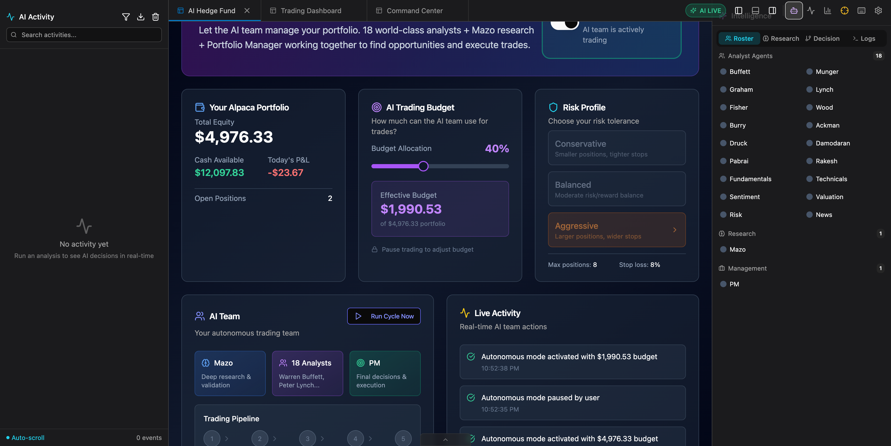
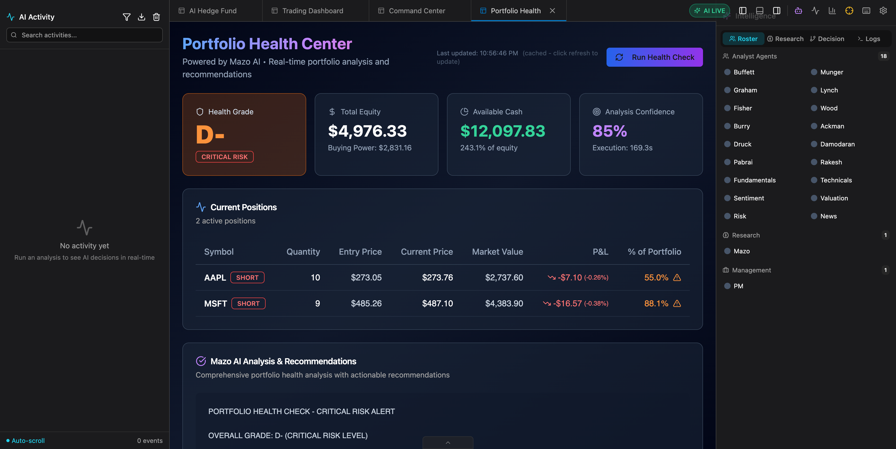
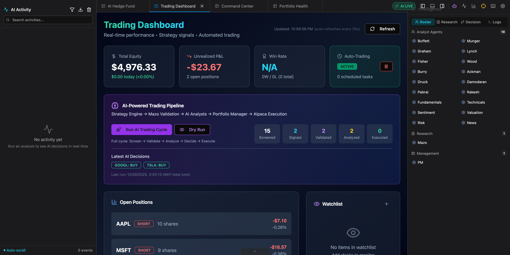
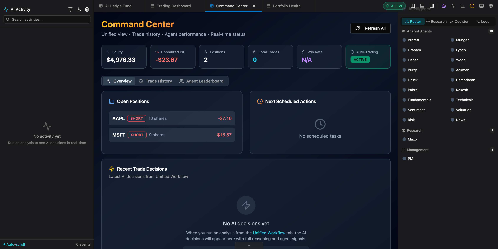
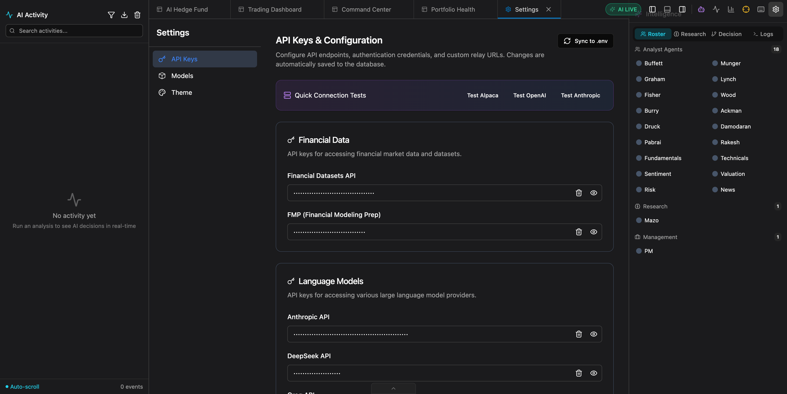
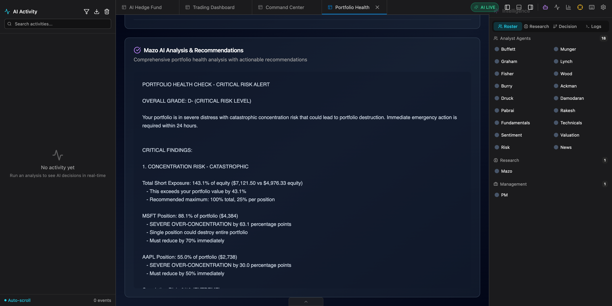
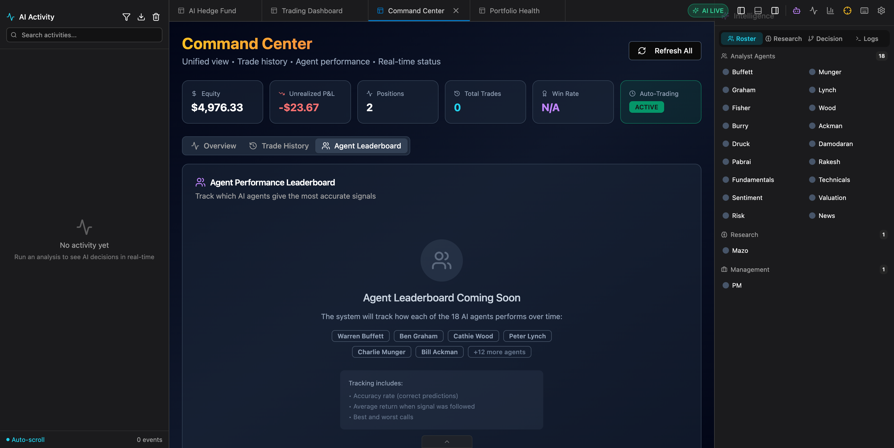
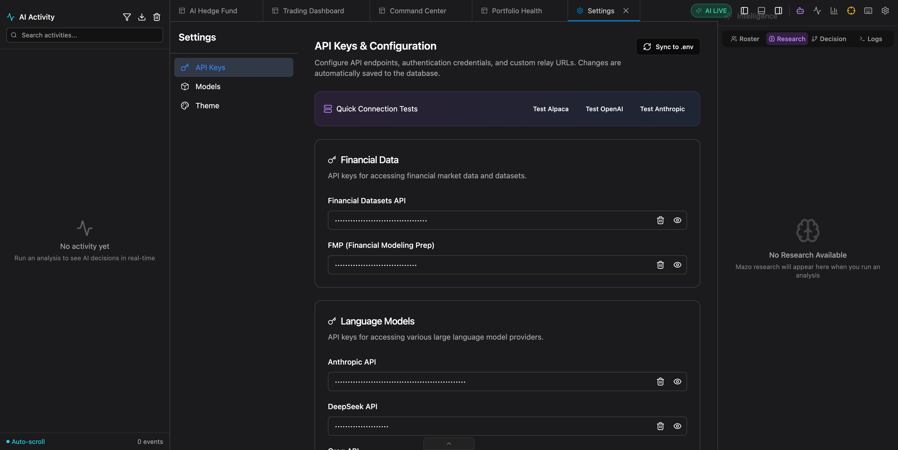

# 🤖 Mazo Pantheon - AI Hedge Fund

**One Team. One Dream. One AI-Powered Hedge Fund.**

An autonomous AI trading system that combines 18 specialized trading agents, deep financial research, and a Portfolio Manager to make intelligent trading decisions on your behalf.

> ⚠️ **Disclaimer**: This is for **educational and research purposes only**. Not financial advice. Use paper trading to test. Deploy to live trading at your own risk.


---

## 📸 Screenshots

<details>
<summary><strong>Click to expand screenshot gallery</strong></summary>

| Feature | Screenshot |
|---------|------------|
| **AI Hedge Fund** - Main trading dashboard |  |
| **Quick Analysis** - Instant ticker analysis |  |
| **Portfolio Health** - AI-powered health check |  |
| **Trading Dashboard** - Pipeline & positions |  |
| **Command Center** - Unified view |  |
| **Settings** - API configuration |  |

</details>

---

## 🎯 What Is This?

Mazo Pantheon is a complete AI-powered trading platform that:

1. **Scans the market** for trading opportunities using multiple strategies
2. **Validates signals** through Mazo's deep research agent
3. **Analyzes trades** with 18 AI agents (each with unique investment philosophies)
4. **Executes decisions** through a Portfolio Manager that weighs all perspectives
5. **Runs autonomously** 24/7 on your own infrastructure

```
┌─────────────────────────────────────────────────────────────────────────┐
│                         YOUR AI TRADING TEAM                            │
├─────────────────────────────────────────────────────────────────────────┤
│                                                                         │
│   📊 Strategy Engine     →    🔬 Mazo Research    →    🧠 18 AI Agents │
│   (Market Scanning)           (Deep Analysis)          (Trading Views) │
│                                                                         │
│                              ↓                                          │
│                                                                         │
│                    💼 Portfolio Manager (Final Decision)                │
│                              ↓                                          │
│                    📈 Alpaca Trade Execution                            │
│                                                                         │
└─────────────────────────────────────────────────────────────────────────┘
```

---

## 🚀 Quick Start (Docker)

### Prerequisites

- Docker & Docker Compose
- API Keys (see [Configuration](#configuration))

### Deploy in 3 Steps

```bash
# 1. Clone the repository
git clone https://github.com/yourusername/mazo-pantheon.git
cd mazo-pantheon

# 2. Configure your API keys
cp .env.example .env
nano .env  # Add your API keys

# 3. Deploy with Docker Compose
cd docker
docker-compose -f docker-compose.unraid.yml up -d
```

### Access the UI

| Service | URL |
|---------|-----|
| **Web UI** | http://localhost:5173 |
| **API Docs** | http://localhost:8000/docs |

---

## 🏗️ Architecture

```
┌─────────────────────────────────────────────────────────────────────────┐
│                           DOCKER CONTAINERS                             │
├─────────────────────────────────────────────────────────────────────────┤
│                                                                         │
│  ┌─────────────────┐  ┌─────────────────┐  ┌─────────────────────────┐ │
│  │  mazo-frontend  │  │  mazo-backend   │  │  mazo-postgres          │ │
│  │  (React/Nginx)  │  │  (FastAPI)      │  │  (Trade History)        │ │
│  │  Port: 5173     │  │  Port: 8000     │  │  Port: 5432             │ │
│  └────────┬────────┘  └────────┬────────┘  └─────────────────────────┘ │
│           │                    │                                        │
│           └────────────────────┼─────────────────────────────────────── │
│                                │                                        │
│  ┌─────────────────────────────┴─────────────────────────────────────┐ │
│  │                        Backend Services                            │ │
│  ├────────────────────────────────────────────────────────────────────┤ │
│  │  • 18 AI Trading Agents (LangGraph)                                │ │
│  │  • Mazo Research Agent (Bun/TypeScript)                            │ │
│  │  • Strategy Engine (Momentum, Mean Reversion, Trend)               │ │
│  │  • Portfolio Manager (Aggregates all signals)                      │ │
│  │  • Autonomous Scheduler (APScheduler)                              │ │
│  │  • Alpaca Trading Integration                                      │ │
│  └────────────────────────────────────────────────────────────────────┘ │
│                                                                         │
│  ┌─────────────────┐                                                    │
│  │  mazo-redis     │ ← Caching Layer                                    │
│  │  Port: 6379     │                                                    │
│  └─────────────────┘                                                    │
│                                                                         │
└─────────────────────────────────────────────────────────────────────────┘
```

---

## 🤖 The AI Team

### Trading Agents (18 Total)

Each agent analyzes stocks from a unique investment philosophy:

| Category | Agents | Philosophy |
|----------|--------|------------|
| **Value Investors** | Ben Graham, Warren Buffett, Charlie Munger, Mohnish Pabrai, Michael Burry | Margin of safety, quality at fair prices |
| **Growth Investors** | Cathie Wood, Peter Lynch, Phil Fisher | Innovation, ten-baggers, scuttlebutt |
| **Macro/Quant** | Stanley Druckenmiller, Aswath Damodaran | Asymmetric opportunities, disciplined valuation |
| **Activist** | Bill Ackman, Rakesh Jhunjhunwala | Activist positions, emerging markets |
| **Technical** | Valuation, Sentiment, Fundamentals, Technicals, Risk Manager | Data-driven analysis |
| **Decision Maker** | Portfolio Manager | Weighs all signals, makes final call |

### Mazo Research Agent

Deep autonomous research that:
- Searches the web for real-time information
- Analyzes company fundamentals
- Provides comprehensive investment thesis
- Validates or challenges trading signals

---

## ⚙️ Configuration

### Required API Keys

| Key | Purpose | Get It |
|-----|---------|--------|
| `FINANCIAL_DATASETS_API_KEY` | Stock data, metrics, news | [financialdatasets.ai](https://financialdatasets.ai/) |
| `OPENAI_API_KEY` | LLM for AI agents | [platform.openai.com](https://platform.openai.com/) |
| `ALPACA_API_KEY` + `ALPACA_SECRET_KEY` | Trade execution | [alpaca.markets](https://alpaca.markets/) |

### Optional API Keys

| Key | Purpose |
|-----|---------|
| `ANTHROPIC_API_KEY` | Claude models |
| `GROQ_API_KEY` | Fast inference |
| `GOOGLE_API_KEY` | Gemini models |
| `TAVILY_API_KEY` | Web search for research |
| `FMP_API_KEY` | Alternative financial data |

### Environment Variables

```bash
# ===========================================
# REQUIRED - Core Functionality
# ===========================================
FINANCIAL_DATASETS_API_KEY=your-key
OPENAI_API_KEY=your-key
ALPACA_API_KEY=your-key
ALPACA_SECRET_KEY=your-secret
ALPACA_BASE_URL=https://paper-api.alpaca.markets/v2
ALPACA_TRADING_MODE=paper

# ===========================================
# DOCKER DEPLOYMENT
# ===========================================
MAZO_PATH=/app/mazo          # Path inside container
MAZO_TIMEOUT=300
POSTGRES_PASSWORD=your-secure-password

# ===========================================
# AUTONOMOUS TRADING
# ===========================================
AUTO_TRADING_ENABLED=false   # Set to true to enable
TRADING_INTERVAL_MINUTES=30  # How often to scan

# ===========================================
# OPTIONAL - Additional LLM Providers
# ===========================================
ANTHROPIC_API_KEY=your-key
GROQ_API_KEY=your-key
TAVILY_API_KEY=your-key
```

---

## 📦 Deployment Options

### Option 1: Unraid (Recommended for Home Labs)

```bash
# SSH to your Unraid server
ssh root@your-unraid-server

# Clone and deploy
cd /mnt/user/appdata
git clone https://github.com/yourusername/mazo-pantheon.git
cd mazo-pantheon

# Configure
cp .env.example .env
nano .env  # Set MAZO_PATH=/app/mazo

# Deploy
cd docker
docker-compose -f docker-compose.unraid.yml up -d
```

Access at: `http://your-unraid-ip:5173`

### Option 2: Docker Compose (Any Server)

```bash
docker-compose -f docker/docker-compose.unraid.yml up -d
```

### Option 3: Kubernetes (EKS/AKS/GKE)

See [docs/DEPLOYMENT.md](docs/DEPLOYMENT.md) for Kubernetes manifests.

```bash
# Apply Kubernetes configs
kubectl apply -f k8s/namespace.yaml
kubectl apply -f k8s/secrets.yaml
kubectl apply -f k8s/deployment.yaml
kubectl apply -f k8s/service.yaml
```

### Option 4: Local Development

```bash
# Backend
cd mazo-pantheon
python -m venv venv
source venv/bin/activate
pip install -r requirements.txt
cd mazo && bun install && cd ..
uvicorn app.backend.main:app --port 8000

# Frontend (new terminal)
cd app/frontend
npm install
npm run dev
```

---

## 🖥️ Using the Web UI

### AI Hedge Fund Tab

The main dashboard for autonomous trading:

1. **Set Your Budget** - How much the AI can allocate per trade
2. **Choose Risk Level** - Conservative, Balanced, or Aggressive
3. **Enable Autonomous Mode** - Let the AI trade for you
4. **Monitor Activity** - Watch trades and performance in real-time


#### Quick Analysis

Run targeted analysis on any ticker without waiting for the autonomous cycle:


### Portfolio Health

Get comprehensive AI-powered portfolio analysis with actionable recommendations:


The Mazo AI provides detailed position-by-position analysis with specific rebalancing recommendations:



### Trading Dashboard

View your trading pipeline, positions, and AI decisions:


Features:
- Real-time portfolio performance
- Open positions with P&L
- AI trading pipeline status
- Latest AI decisions
- Watchlist and scheduled tasks

### Command Center

Unified view with trade history and agent performance tracking:


Track which AI agents give the most accurate signals:



### Settings

Configure via the web UI (no need to edit files):


Features:
- API Keys for all providers
- Custom relay URLs
- Data source fallbacks (Yahoo Finance, FMP)
- Workflow optimization
- Trading parameters

---

## 🔍 Transparency Sidebars

The UI includes transparency panels for full insight into AI operations:

### Intelligence Panel (Right Sidebar)

| Tab | Purpose |
|-----|---------|
| **Roster** | View all 18 AI agents + Mazo + PM |
| **Research** | Mazo research reports appear here |
| **Decision** | Decision tree visualization |
| **Logs** | Real-time console output |



### AI Activity Feed (Left Sidebar)

Real-time timeline of all AI decisions and actions as they happen.

---

## 📊 Workflow Modes

| Mode | Description | Use Case |
|------|-------------|----------|
| **Signal Only** | AI agents analyze, no research | Quick signals |
| **Research Only** | Mazo deep research only | Due diligence |
| **Pre-Research** | Research first → informed signal | Best accuracy |
| **Post-Research** | Signal first → Mazo explains | Understanding decisions |
| **Full** | Complete pipeline | Maximum confidence |

---

## 🔄 Autonomous Trading Schedule

When autonomous mode is enabled, the system runs on this schedule (market hours):

| Time | Task |
|------|------|
| 9:35 AM | Morning market scan |
| 11:00 AM | Mid-morning health check |
| 2:00 PM | Afternoon analysis |
| 3:30 PM | Pre-close watchlist monitor |
| 4:05 PM | Daily performance report |
| Every 5 min | Position monitor (stop-loss/take-profit) |
| Every 30 min | Full AI trading cycle |

---

## 📁 Project Structure

```
mazo-pantheon/
├── docker/                    # 🐳 Docker deployment
│   ├── docker-compose.unraid.yml
│   ├── Dockerfile.backend
│   └── Dockerfile.frontend
├── app/
│   ├── backend/               # 🐍 FastAPI server
│   │   ├── main.py
│   │   ├── routes/
│   │   └── services/
│   └── frontend/              # ⚛️ React UI
│       └── src/
├── src/
│   ├── agents/                # 🤖 18 AI trading agents
│   ├── trading/               # 📈 Trading services
│   └── tools/                 # 🔧 Financial data APIs
├── mazo/                      # 🔬 Research agent (TypeScript)
├── integration/               # 🔗 Workflow orchestration
└── docs/                      # 📚 Documentation
```

---

## 🛠️ Troubleshooting

### Container won't start

```bash
# Check logs
docker logs mazo-backend

# Common issues:
# - Missing API keys in .env
# - MAZO_PATH not set to /app/mazo
# - Port already in use
```

### CORS errors in browser

The backend allows all origins by default. If you see CORS errors:
```bash
docker restart mazo-backend
```

### API keys not working

Configure via the web UI: Settings → API Keys
Or sync from .env:
```bash
curl -X POST http://localhost:8000/api-keys/sync-to-env
```

### Black screen on Trading Dashboard

1. Hard refresh (Cmd+Shift+R)
2. Check browser console for errors
3. Verify backend is running: `curl http://localhost:8000/`

---

## 🤝 Contributing

1. Fork the repository
2. Create a feature branch
3. Make your changes
4. Submit a pull request

---

## 📄 License

MIT License - See [LICENSE](LICENSE) for details.

---

## 🙏 Acknowledgments

- [LangGraph](https://langchain-ai.github.io/langgraph/) for agent orchestration
- [Alpaca](https://alpaca.markets/) for trading API
- [Financial Datasets](https://financialdatasets.ai/) for market data
- All the legendary investors whose philosophies inspire our AI agents

---

**Built with ❤️ for algorithmic traders who believe in AI-powered decision making.**
