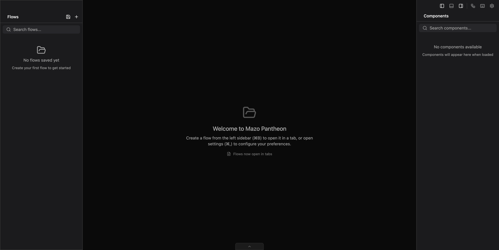
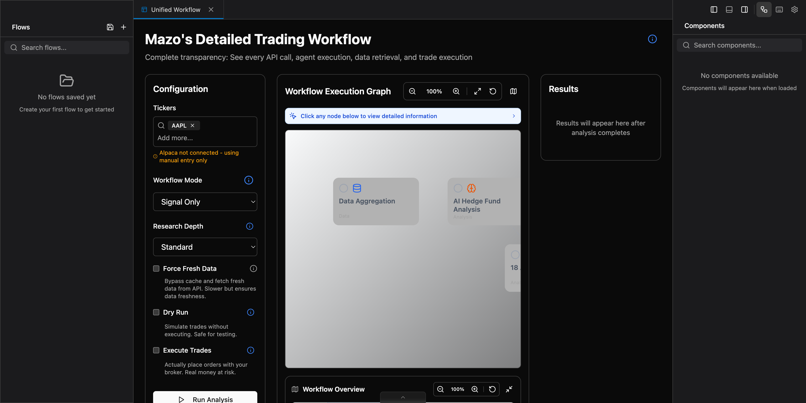
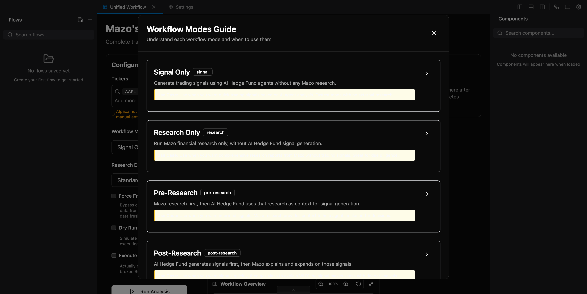
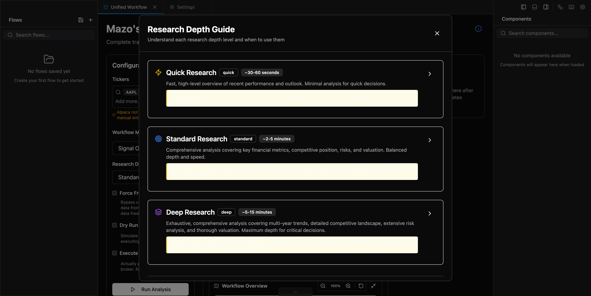
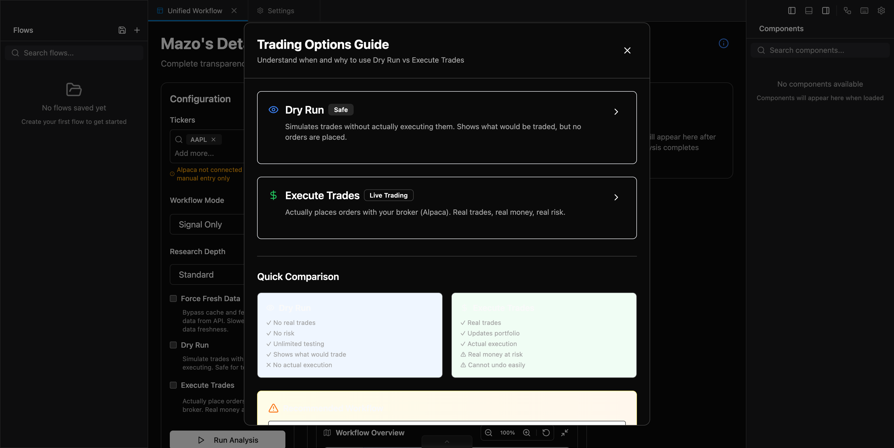
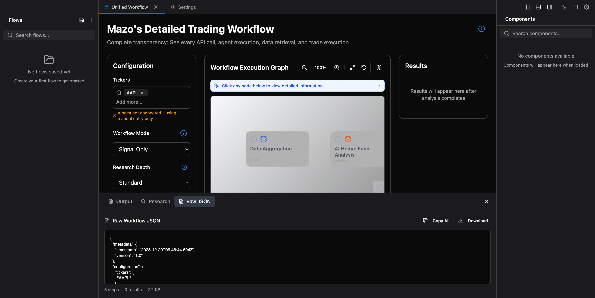
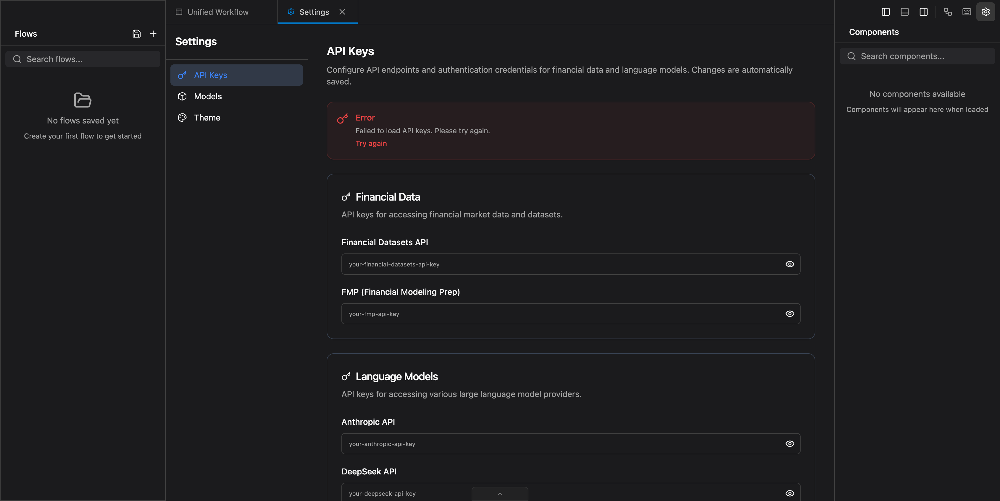
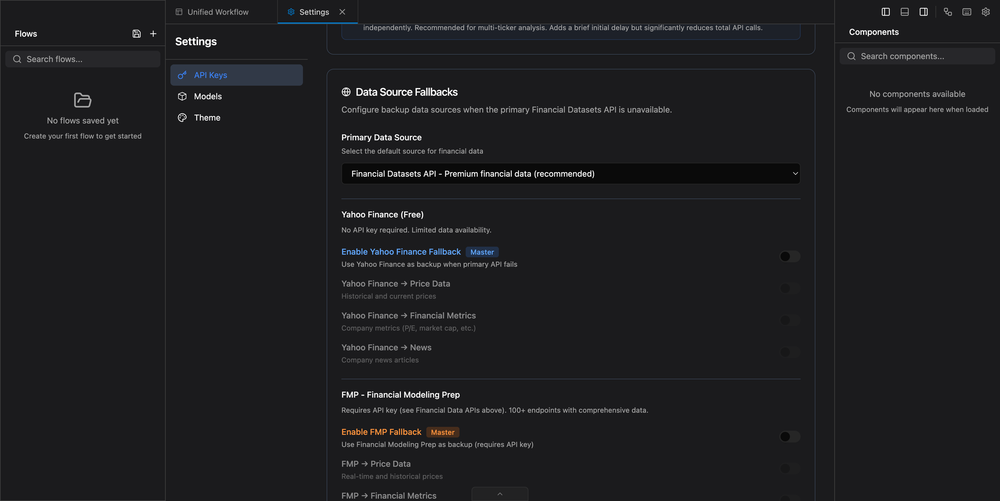
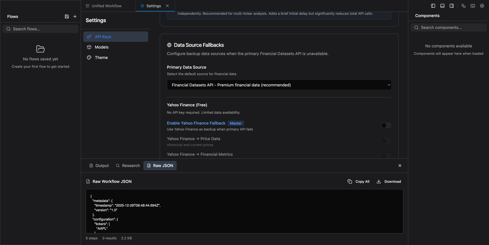
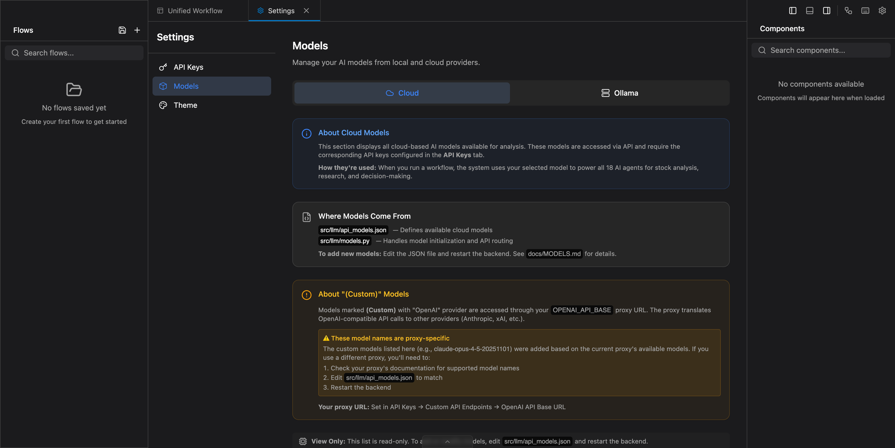

# Mazo Pantheon

An AI-powered hedge fund combining multi-agent trading signals with autonomous financial research.

> ⚠️ **Disclaimer**: This is for **educational purposes only**. Not financial advice. Use at your own risk.

## Overview

This system integrates two AI components:

| Component | Description |
|-----------|-------------|
| **AI Hedge Fund** | 18 specialized agents generating trading signals |
| **Mazo Research** | Autonomous deep financial research agent |

## Screenshots

### Main Dashboard


### Unified Workflow
Complete transparency with workflow execution graph, configuration options, and real-time progress tracking.


### Workflow Mode Dropdown
Select from 5 workflow modes: Signal Only, Research Only, Pre-Research, Post-Research, or Full Workflow.


### Workflow Modes Guide
Built-in help explaining each workflow mode, token usage, cost estimates, and recommendations.


### Research Depth Dropdown
Choose research depth: Quick (30-60s), Standard (2-5min), or Deep (5-15min).


### Research Depth Guide
Detailed explanation of each research depth level, token costs, and when to use each.


### Trading Options Guide
Understand Dry Run vs Execute Trades, recommended workflows, and safety practices.


### Raw JSON Output
Inspect the full workflow state as JSON - useful for debugging and export.


### Settings - API Keys
Configure all API keys for financial data, LLM providers, web search, and trading.


### Settings - Data Source Fallbacks
Configure backup data sources (Yahoo Finance, FMP) when primary API is unavailable.


### Primary Data Source Dropdown
Choose your preferred data source: Financial Datasets API, FMP, or Yahoo Finance.


### Settings - Models
View available cloud and local (Ollama) models with provider information.


---

## Quick Start

### 1. Setup Environment

```bash
# Clone and enter directory
git clone https://github.com/yourusername/mazo-pantheon.git
cd mazo-pantheon

# Create Python virtual environment
python3 -m venv venv
source venv/bin/activate

# Install Python dependencies
pip install -r requirements.txt

# Install Mazo (TypeScript) dependencies
cd mazo && bun install && cd ..
```

### 2. Configure API Keys

```bash
cp .env.example .env
# Edit .env with your actual API keys
```

**Required keys:**
- `FINANCIAL_DATASETS_API_KEY` - Financial data ([get here](https://financialdatasets.ai/))
- `OPENAI_API_KEY` - LLM provider ([get here](https://platform.openai.com/))

**Optional keys:**
- `ANTHROPIC_API_KEY`, `GROQ_API_KEY`, `GOOGLE_API_KEY` - Alternative LLM providers
- `TAVILY_API_KEY` - Web search for research
- `ALPACA_API_KEY` + `ALPACA_SECRET_KEY` - Paper/live trading

### 3. Start the Application

**Option A: Run Script (Recommended)**
```bash
./app/run.sh
```

**Option B: Manual Start**
```bash
# Terminal 1 - Backend
source venv/bin/activate
python -m uvicorn app.backend.main:app --host 0.0.0.0 --port 8000

# Terminal 2 - Frontend
cd app/frontend && npm run dev
```

### 4. Access the UI

- **Web UI**: http://localhost:5173
- **API Docs**: http://localhost:8000/docs

---

## Architecture

```
┌─────────────────────────────────────────────────────────────┐
│                      Web UI (React)                         │
│                   localhost:5173                            │
└─────────────────────┬───────────────────────────────────────┘
                      │
┌─────────────────────▼───────────────────────────────────────┐
│                   FastAPI Backend                           │
│                   localhost:8000                            │
├─────────────────────────────────────────────────────────────┤
│  /unified-workflow  │  /hedge-fund  │  /api-keys  │  /mazo │
└──────────┬──────────┴───────┬───────┴──────┬──────┴────┬────┘
           │                  │              │           │
┌──────────▼──────────┐ ┌─────▼─────┐ ┌──────▼────┐ ┌────▼────┐
│  Unified Workflow   │ │ 18 Agents │ │  SQLite   │ │  Mazo   │
│  Orchestrator       │ │ LangGraph │ │  Database │ │  (Bun)  │
└─────────────────────┘ └───────────┘ └───────────┘ └─────────┘
```

---

## Trading Agents

18 specialized agents analyze stocks from different perspectives:

### Value Investors
- **Ben Graham** - Margin of safety, hidden gems
- **Warren Buffett** - Wonderful companies at fair prices
- **Charlie Munger** - Quality businesses only
- **Mohnish Pabrai** - Low-risk doubles (Dhandho)
- **Michael Burry** - Contrarian deep value

### Growth Investors
- **Cathie Wood** - Innovation and disruption
- **Peter Lynch** - Ten-baggers in everyday businesses
- **Phil Fisher** - Deep scuttlebutt research

### Macro/Quantitative
- **Stanley Druckenmiller** - Asymmetric macro opportunities
- **Aswath Damodaran** - Disciplined valuation

### Regional/Other
- **Bill Ackman** - Activist positions
- **Rakesh Jhunjhunwala** - India's Big Bull

### Technical Agents
- **Valuation Agent** - Intrinsic value calculation
- **Sentiment Agent** - Market sentiment analysis
- **Fundamentals Agent** - Financial data analysis
- **Technicals Agent** - Technical indicators
- **Risk Manager** - Risk metrics and position limits
- **Portfolio Manager** - Final trading decisions

---

## Workflow Modes

Access via the **Unified Workflow** tab in the UI:

| Mode | Description |
|------|-------------|
| `signal` | AI Hedge Fund analysis only |
| `research` | Mazo research only |
| `pre-research` | Research first → informed trading signal |
| `post-research` | Signal first → Mazo explains the decision |
| `full` | Complete: pre-research → signal → post-research |

---

## Configuration

All configuration is in a single `.env` file at the project root.

The `mazo/.env` is a symlink to the root `.env` (single source of truth).

### Key Settings

```bash
# LLM Provider
OPENAI_API_KEY=your-key
OPENAI_API_BASE=https://api.openai.com/v1  # or custom proxy

# Financial Data
FINANCIAL_DATASETS_API_KEY=your-key

# Mazo Settings
MAZO_PATH=/path/to/mazo-pantheon/mazo
MAZO_TIMEOUT=300
DEFAULT_WORKFLOW_MODE=full
DEFAULT_RESEARCH_DEPTH=standard

# Trading (Alpaca)
ALPACA_API_KEY=your-key
ALPACA_SECRET_KEY=your-secret
ALPACA_BASE_URL=https://paper-api.alpaca.markets/v2
ALPACA_TRADING_MODE=paper
```

---

## Project Structure

```
mazo-pantheon/
├── .env                    # Configuration (single source of truth)
├── .env.example            # Template for new users
├── app/
│   ├── backend/            # FastAPI server
│   │   ├── main.py         # Entry point
│   │   ├── routes/         # API endpoints
│   │   ├── services/       # Business logic
│   │   └── database/       # SQLite models
│   └── frontend/           # React UI
│       └── src/
│           ├── components/ # UI components
│           ├── contexts/   # React contexts
│           └── services/   # API clients
├── integration/            # Unified workflow
│   ├── unified_workflow.py # Orchestrator
│   ├── mazo_bridge.py      # Python ↔ Mazo bridge
│   └── config.py           # Integration config
├── mazo/                   # Mazo research agent (TypeScript)
│   ├── .env -> ../.env     # Symlink to root .env
│   └── src/                # Mazo source code
├── src/
│   ├── agents/             # 18 trading agents
│   ├── backtesting/        # Backtesting engine
│   ├── llm/                # LLM providers
│   ├── tools/              # Financial data APIs
│   └── utils/              # Helpers
└── docker/                 # Docker deployment files
```

---

## API Endpoints

| Endpoint | Method | Description |
|----------|--------|-------------|
| `/health` | GET | Health check |
| `/unified-workflow/run` | POST | Run unified workflow (SSE) |
| `/hedge-fund/run` | POST | Run AI Hedge Fund only |
| `/hedge-fund/agents` | GET | List available agents |
| `/api-keys/` | GET/POST | Manage API keys |
| `/env-sync/sync` | POST | Sync .env to database |

Full API docs: http://localhost:8000/docs

---

## Troubleshooting

### Backend won't start
```bash
# Check if port is in use
lsof -ti:8000 | xargs kill -9

# Verify virtual environment
which python  # Should show venv path
```

### Frontend won't start
```bash
cd app/frontend
npm install
npm run dev
```

### API keys not showing in Settings
```bash
# Force sync from .env to database
curl -X POST "http://localhost:8000/env-sync/sync?overwrite=true"
```

### Rate limit errors
- The system has built-in rate limiting
- Check your LLM provider quotas
- Consider using a proxy with higher limits

---

## License

MIT License - See LICENSE file for details.
